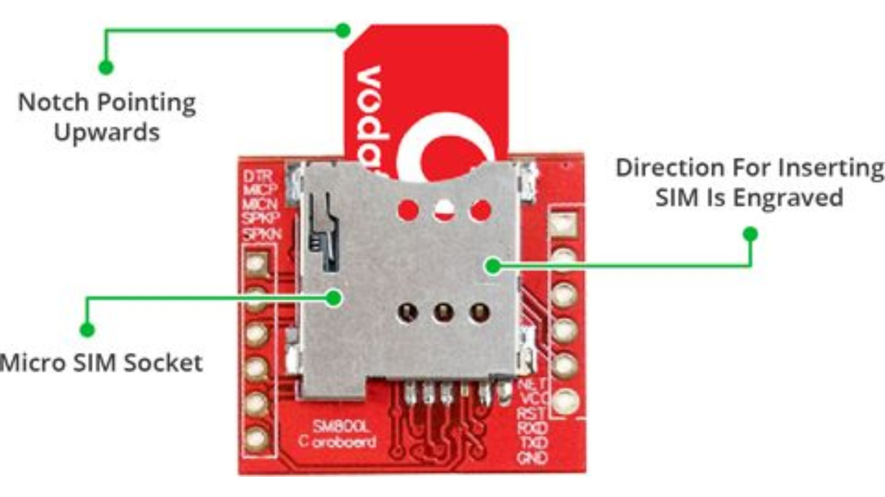

# SIM800L

**1. WHAT IS GSM?**

GSM, which stands for Global System for Mobile, is a cellular standard primarily designed for mobile communication. GSM is a standard developed to facilitate communication between mobile devices. It's a digital cellular network technology that enables users to make calls, send texts, and access basic data services like SMS (Short Message Service) and MMS (Multimedia Messaging Service). GSM networks operate on various frequency bands globally, allowing mobile subscribers international roaming capabilities.

**2. WHAT IS GPRS?**

GPRS, which stands for General Packet Radio Service. GPRS is an enhancement of the GSM standard that enables mobile data transmission. It introduces packet-switched technology to GSM networks, allowing for faster data transfer rates compared to traditional circuit-switched methods. GPRS enables features like internet browsing, email access, and other data-intensive applications on mobile devices. It optimizes network resources by only using bandwidth when data is being transmitted, making it more efficient for data communication than its predecessor.

| Feature                            | GSM                                                                  | GPRS                                                                           |
| ---------------------------------- | -------------------------------------------------------------------- | ------------------------------------------------------------------------------ | 
| Acronym                            | Global System for Mobile Communications                              | General Packet Radio Service)                                                  | 
| Technology                         | Circuit-switched                                                     | Packet-switched                                                                |
| Voice Communication                | Primary focus, supports voice calls and SMS                          | Secondary, supports voice but is optimized for data                            |
| Data Transmission                  | Initially designed for voice, supports data with added functionality | Optimized for data transmission                                                | 
| Data Speed                         | Upto 9.6 kbps                                                        | Typically up to 114 kbps (2.5G), later enhancements offer higher speeds        | 
| Connection Duration                | Always-on connection for voice calls                                 | On-demand connection, data sessions initiated as needed                        | 
| Billing                            | Billed based on usage (calls and SMS)                                | Billed based on data transferred, usually in kilobytes or megabytes            | 
| Network Architecture               | Traditional cellular network with a voice-centric focus              | Overlay on GSM network, utilizing existing infrastructure for data services    |
| Application                        | Voice calls, SMS, low-bandwidth data applications                    | Internet browsing, email, multimedia messaging, mobile apps, IoT connectivity  |

**3. HARDWARE OVERVIEW**

At the heart of the module is a SIM800L GSM cellular chip from Simcom.

The operating voltage of the chip ranges from 3.4V to 4.4V, making it an ideal candidate for direct LiPo battery supply. This makes it an excellent choice for embedding in projects with limited space.

All the necessary data pins of the SIM800L GSM chip are broken out to a 0.1″ pitch headers, including the pins required for communication with the microcontroller over the UART. The module supports baud rates ranging from 1200 bps to 115200 bps and features automatic baud rate detection.

The module requires an external antenna in order to connect to the network. So the module usually comes with a helical antenna that can be soldered to it. The board also has a U.FL connector If you wish to keep the antenna at a distance from the board.

There’s a SIM socket on the back! Any 2G Micro SIM card will work perfectly. The proper way to insert the SIM card is typically engraved on the surface of the SIM socket.

**4. FEATURE**

Even though this module is incredibly small—only 1 square inch—it contains a surprising number of features. Some of them are as follows:

* Supports Quad-band: GSM850, EGSM900, DCS1800 and PCS1900
* Connect onto any global GSM network with any 2G SIM
* Make and receive voice calls using an external 8Ω speaker & electret microphone
* Send and receive SMS messages
* Send and receive GPRS data (TCP/IP, HTTP, etc.)
* Scan and receive FM radio broadcasts

* **Transmit Power:**
  * Class 4 (2W) for GSM850
  * Class 1 (1W) for DCS1800
* Serial-based AT Command Set
* FL connectors for cell antennae
* Accepts Micro SIM Card

**5. LED STATUS INDICATORS**

The SIM800L module has an LED that indicates the status of your cellular network. It will blink at different rates depending on the state it is in.

***Blink every 1s:**
* The chip is running but hasn’t made a connection to the cellular network yet.

